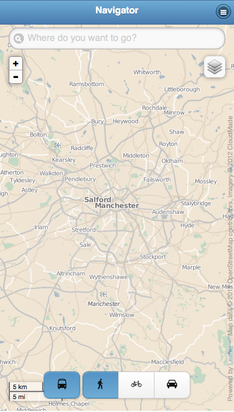
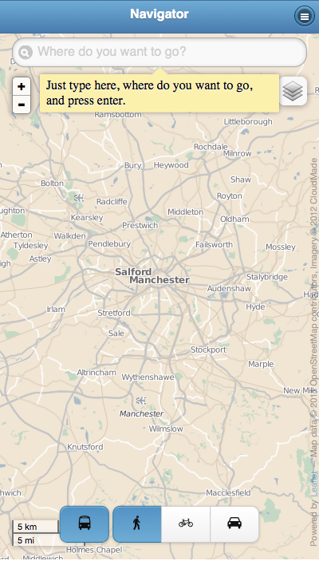

City Navigator
==============

.. include:: robot.rst

.. toctree::
   :hidden:

   robot

This is how City Navigator looks like in Manchester when started:

.. code:: robotframework
   :class: hidden

   *** Test cases ***

   Show navigator window
       Go to  ${START_URL}

       # Override local_config area to manchester
       # and wait for map tiles to finish loading
       Execute Javascript
       ...    citynavi.set_config("manchester");
       ...    map_dbg.setView(citynavi.config.center, 10);
       Sleep  10 s

       Capture page screenshot  navigatorwindow.png

It automatically determines the location of the device and zooms there:

.. figure:: navigatorwindow-located.png

.. code:: robotframework
   :class: hidden

   *** Test cases ***

   Zoom to current location
       Execute Javascript
       ...    return (function(){
       ...        var lat = citynavi.config.center[0],
       ...            lng = citynavi.config.center[1],
       ...            accuracy = 100,
       ...            latAccuracy = 180 * accuracy / 40075017,
       ...            lngAccuracy = latAccuracy / Math.cos(L.LatLng.DEG_TO_RAD * lat),
       ...            bounds = L.latLngBounds(
       ...                [lat - latAccuracy, lng - lngAccuracy],
       ...                [lat + latAccuracy, lng + lngAccuracy]);
       ...        map_dbg.fire('locationfound', {
       ...            'accuracy': accuracy,
       ...            'latlng': L.latLng(lat, lng),
       ...            'bounds': bounds
       ...        });
       ...    })();
       # Wait until the zoom animation finishes
       Sleep  10 s
       Capture page screenshot  navigatorwindow-located.png

Once City Navigator has located you, just type, where you are planning to go:

.. code:: robotframework
   :class: hidden

   *** Test cases ***

   Annotate navigator window
       Assign id to element
       ...  xpath=//input[@placeholder='Where do you want to go?']
       ...  search
       ${note} =  Add note  search
       ...  Just type here, where you want to go, and wait a second for the results.
       ...  position=bottom  width=300
       Input text  search  market
       Capture page screenshot  navigatorwindow-annotated.png
       Remove elements  ${note}

And pick the intended destination from the list:

.. figure:: navigatorwindow-results.png

.. code:: robotframework
   :class: hidden

   *** Test cases ***

   Show search results
       Wait until element is visible
       ...  xpath=//a[contains(text(), 'Wellington Road')]
       Assign id to element
       ...  xpath=//a[contains(text(), 'Wellington Road')]
       ...  market-link
       ${note} =  Add note  market-link
       ...  Click the result to see the available routes.
       ...  position=bottom  width=300
       Capture page screenshot  navigatorwindow-results.png
       Remove elements  ${note}

City Navigator suggests an itinerary and displays it on the map. At
the bottom of the screen, below the itinerary overview, there may be a
couple of alternatives that can be chosen by tapping them.

.. figure:: navigatorwindow-itineraries.png

.. code:: robotframework
   :class: hidden

   *** Test cases ***

   Show search result
       Click link  market-link
       Sleep  10 s
       Capture page screenshot  navigatorwindow-itineraries.png

When you are ready to start with the chosen itinerary, tap "Let's go":

.. figure:: navigatorwindow-alternative-itinerary.png

.. code:: robotframework
   :class: hidden

   *** Test cases ***

   Choose another itinerary alternative
       Click element  css=.ui-page-active .route-buttons-1
       Sleep  1 s
       Capture page screenshot  navigatorwindow-alternative-itinerary.png

That's all - now you can get on your way!

.. figure:: navigatorwindow-navigation.png

.. code:: robotframework
   :class: hidden

   *** Test cases ***

   Start navigation
       Click link "Let's go"
       Capture page screenshot  navigatorwindow-navigation.png

In the top-right corner, there's a menu with more features:

.. figure:: navigatorwindow-menu.png

.. code:: robotframework
   :class: hidden

   *** Test cases ***

   Open menu
       Click link "Back"
       Sleep  1 s
       Click link "Back"
       Sleep  1 s
       Click link "Menu"
       Sleep  1 s
       Capture page screenshot  navigatorwindow-menu.png

For instance, instead of typing in a destination, you can choose from
a list of nearest services:

.. figure:: navigatorwindow-services.png

.. code:: robotframework
   :class: hidden

   *** Test cases ***

   Display list of services
       Click link "Find nearest services"
       Sleep  1 s
       Capture page screenshot  navigatorwindow-services.png
